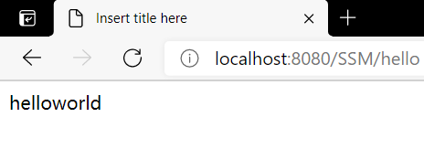
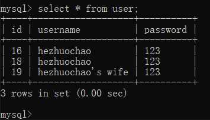
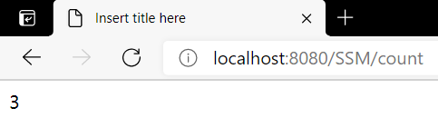

# 实验：SSM 框架整合

## 基本信息

- 班级：软件181
- 学号：3180121088
- 姓名：贺卓超

## 实验目的
1. 掌握 Maven 项目的使用方法
2. 搭建基本的SSM框架
3. 学会处理过程中的错误

## 实验内容
1. 数据库和 Maven 准备
2. Spring + MyBatis 的整合工作
3. SSM的整合：输出数据库中一张表的条目数

## 实验过程和程序
1. 在 gitee 中，点击项目的 Fork 按钮，从远程复制到自己的库里，然后通过 git base 将项目克隆到本地的文件夹下。
2. 打开 Eclipse 并导入 Maven 项目。
3. 在 https://mvnrepository.com 内搜索并导入相应的 Maven 包。

    ```pom.xml
    <properties>
        <spring-version>5.0.2.RELEASE</spring-version>
    </properties>
    ```
    >上述代码用于定义 spring 版本号，方便统一管理。
4. 将 applicationContext.xml 内的数据库改为自己的用户名和密码。
5. 配置 web.xml 文件，进行 DispatcherSerlvet 的配置和监听器的配置。
    ```web.xml
        <servlet>
            <servlet-name>springmvc</servlet-name>
            <servlet-class>org.springframework.web.servlet.DispatcherServlet</servlet-class>
            <init-param>
                <param-name>contextConfigLocation</param-name>
                <param-value>classpath:spring-mvc.xml</param-value>
            </init-param>
            <load-on-startup>1</load-on-startup>
        </servlet>
        
        <servlet-mapping>
            <servlet-name>springmvc</servlet-name>
            <url-pattern>/</url-pattern>
        </servlet-mapping>
        
        <context-param>
            <param-name>contextConfigLocation</param-name>
            <param-value>classpath:applicationContext.xml</param-value>
        </context-param>
        
        <listener>
            <listener-class>org.springframework.web.context.ContextLoaderListener</listener-class>
        </listener>
    ```
6. 进行 spring-mvc 的配置，开启注解功能和视图解析器,并进行测试。
    ```
        <bean class="org.springframework.web.servlet.view.InternalResourceViewResolver">
            <property name="prefix" value="/WEB-INF/"/>
            <property name="suffix" value=".jsp"/>
        </bean>
        
        <mvc:annotation-driven/>
        <mvc:default-servlet-handler/>
        
        <context:annotation-config/>
        <context:component-scan base-package="cn.edu.xaut.controller"/>
    ```
7. 在 WEB-INF 下，新建 info.jsp 用于显示打印信息。
    ```
    ${ msg }
    ```
8. 新建 Controller 对象，用注解声明控制器对象和用户请求对应的方法，测试服务器的部署和数据库中的 User 的数量。
    ```
    package cn.edu.xaut.controller;

    import java.util.List;

    import org.springframework.beans.factory.annotation.Autowired;
    import org.springframework.stereotype.Controller;
    import org.springframework.ui.Model;
    import org.springframework.web.bind.annotation.RequestMapping;
    import org.springframework.web.servlet.ModelAndView;

    import cn.edu.xaut.entity.User;
    import cn.edu.xaut.service.UserService;

    @Controller
    public class UserController {

        @Autowired
        UserService userService;
        @RequestMapping("/hello")
        public ModelAndView helloworld() {
            
            ModelAndView mv = new ModelAndView().addObject("msg", "helloworld");
            mv.setViewName("info");
            return mv;
            
        }
        
        @RequestMapping("/count")
        public String count(Model model) {
            
            List<User> users = this.userService.getAllUsers();
            model.addAttribute("msg", users.size());
            return "info";
            
        }
        
    }
    ```

## 实验截图

<br/>


<br/>


## 实验心得
    本次实验进行了 Spring 、 SpringMVC 和 MyBatis 的整合，完成了最终的框架的搭建。SpringMVC 的实现原理是通过 Servlet 拦截所有URL来达到控制的目的，也了解到和掌握了 SpringMVC 和 Mybatis 的使用步骤。基本熟悉了 gitee 仓库的使用流程。还有一些Eclipse的使用技巧，比如在取得一些对象的全限定名称时，可以通过 Ctrl + Shift + t 进行搜索。