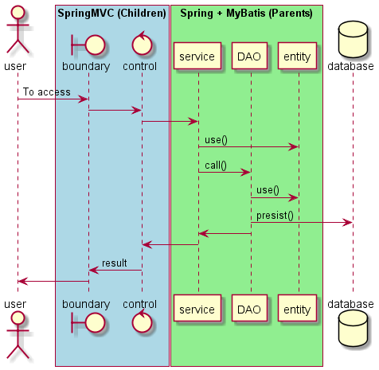

# 实验：SSM 框架整合

## 基本信息

- 班级：
- 学号：
- 姓名：

## 实验目的
1. 掌握 Maven 项目的使用方法
2. 搭建基本的SSM框架
3. 学会处理过程中的错误

## 实验内容
1. 数据库和 Maven 准备
2. Spring + MyBatis 的整合工作
3. SSM的整合：输出数据库中一张表的条目数

## 实验过程和程序

## 实验截图

## 实验心得

